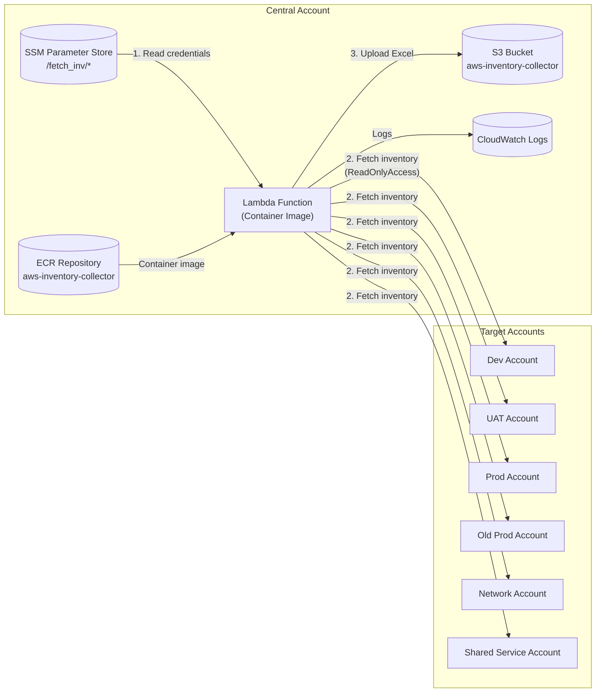
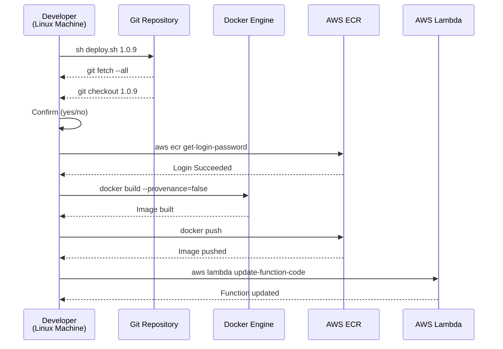
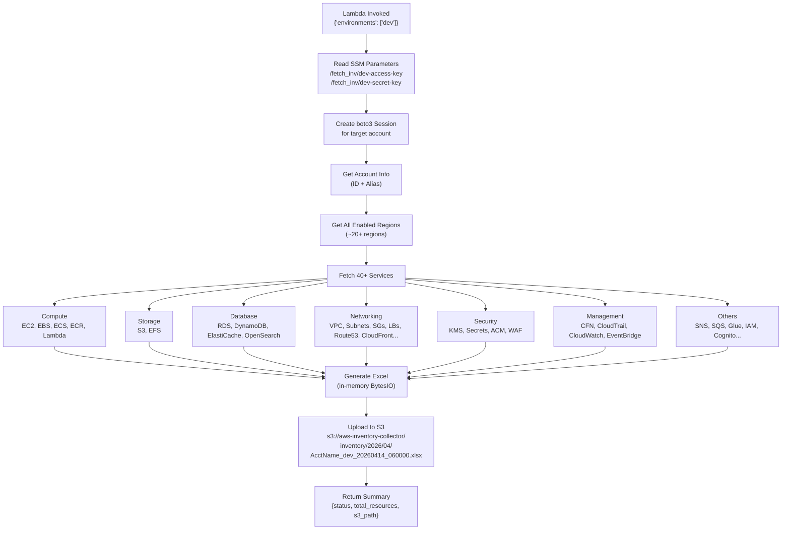
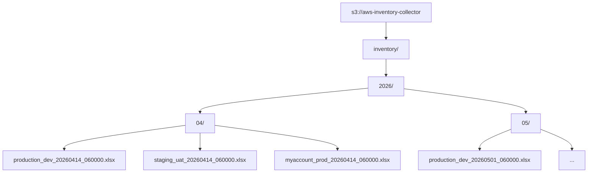
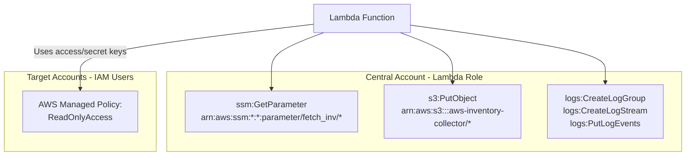

# AWS Multi-Account Inventory Lambda

Docker-based Lambda function that fetches inventory from multiple AWS accounts using credentials stored in SSM Parameter Store, generates Excel reports, and stores them in S3.

## Architecture

### High-Level Overview



### Deployment Flow



### Inventory Collection Flow (Per Invocation)



### S3 Output Structure



### IAM & Permissions



## Prerequisites (Create Manually)

### 1. ECR Repository

Create an ECR repository to store the Docker image:
```bash
aws ecr create-repository --repository-name aws-inventory-collector --region ap-south-1
```

### 2. S3 Bucket

Create a bucket for inventory reports:
```bash
aws s3 mb s3://aws-inventory-collector
```

### 3. SSM Parameters (SecureString)

Store access keys and secret keys for each target account:

```bash
# Dev account
aws ssm put-parameter --name "/fetch_inv/dev-access-key"  --value "AKIA..." --type SecureString
aws ssm put-parameter --name "/fetch_inv/dev-secret-key"  --value "wJal..." --type SecureString

# UAT account
aws ssm put-parameter --name "/fetch_inv/uat-access-key"  --value "AKIA..." --type SecureString
aws ssm put-parameter --name "/fetch_inv/uat-secret-key"  --value "wJal..." --type SecureString

# Prod account
aws ssm put-parameter --name "/fetch_inv/prod-access-key" --value "AKIA..." --type SecureString
aws ssm put-parameter --name "/fetch_inv/prod-secret-key" --value "wJal..." --type SecureString

# Old Prod account
aws ssm put-parameter --name "/fetch_inv/oldprod-access-key" --value "AKIA..." --type SecureString
aws ssm put-parameter --name "/fetch_inv/oldprod-secret-key" --value "wJal..." --type SecureString

# Network account
aws ssm put-parameter --name "/fetch_inv/network-access-key" --value "AKIA..." --type SecureString
aws ssm put-parameter --name "/fetch_inv/network-secret-key" --value "wJal..." --type SecureString

# Shared Service account
aws ssm put-parameter --name "/fetch_inv/sharedservice-access-key" --value "AKIA..." --type SecureString
aws ssm put-parameter --name "/fetch_inv/sharedservice-secret-key" --value "wJal..." --type SecureString
```

The full SSM paths are defined in the `ACCOUNTS` dict at the top of `lambda_function.py`. To add a new account, add a new entry:

```python
ACCOUNTS = {
    'dev': {
        'access_key_ssm': '/fetch_inv/dev-access-key',
        'secret_key_ssm': '/fetch_inv/dev-secret-key',
    },
    # Add new accounts here
    'newaccount': {
        'access_key_ssm': '/fetch_inv/newaccount-access-key',
        'secret_key_ssm': '/fetch_inv/newaccount-secret-key',
    },
}
```

### 4. Lambda Function

Create a Lambda function with container image type:

| Setting     | Value                              |
|-------------|------------------------------------|
| Runtime     | Container image                    |
| Timeout     | 900 seconds (15 min)               |
| Memory      | 512 MB+                            |

Environment variable (optional, defaults to `aws-inventory-collector`):

| Variable     | Value                    | Description              |
|--------------|--------------------------|--------------------------|
| S3_BUCKET    | aws-inventory-collector  | S3 bucket for reports    |

### 5. Lambda IAM Role

Lambda creates a basic execution role by default (CloudWatch Logs). Add the following as an inline policy for SSM and S3 access:

```json
{
  "Version": "2012-10-17",
  "Statement": [
    {
      "Sid": "SSMReadCredentials",
      "Effect": "Allow",
      "Action": [
        "ssm:GetParameter"
      ],
      "Resource": "arn:aws:ssm:*:*:parameter/fetch_inv/*"
    },
    {
      "Sid": "S3UploadReports",
      "Effect": "Allow",
      "Action": [
        "s3:PutObject"
      ],
      "Resource": "arn:aws:s3:::aws-inventory-collector/*"
    }
  ]
}
```

Target account IAM users (whose keys are stored in SSM) need **ReadOnlyAccess** policy attached.

## Deploy

On a Linux machine with Docker and AWS CLI configured:

```bash
git clone <repo-url>
cd <repo>
chmod +x deploy.sh
sh deploy.sh <tag>
```

Example:
```bash
sh deploy.sh 1.0.0
```

The script will:
1. `git fetch --all` and checkout the given tag
2. Show git status and ask for confirmation (yes/no)
3. Login to ECR, build Docker image (with `--provenance=false`), push to ECR
4. Update the Lambda function with the new image
5. Show Lambda function state

ECR repo, Lambda function name, account ID, and region are hardcoded in `deploy.sh`.

## Run

Since the function processes one account per invocation (to stay within the 15-min Lambda timeout), invoke it separately for each environment:

```bash
# Dev account
aws lambda invoke --function-name aws-inventory-collector \
  --payload '{"environments": ["dev"]}' output-dev.json

# UAT account
aws lambda invoke --function-name aws-inventory-collector \
  --payload '{"environments": ["uat"]}' output-uat.json

# Prod account
aws lambda invoke --function-name aws-inventory-collector \
  --payload '{"environments": ["prod"]}' output-prod.json
```

Or invoke from the Lambda console with test event: `{"environments": ["dev"]}`

Without a payload, it defaults to processing all accounts defined in `ACCOUNTS` (may timeout for multiple accounts).

## S3 Output Structure

```
s3://aws-inventory-collector/
  inventory/
    2026/
      04/
        production_dev_20260414_060000.xlsx
        staging_uat_20260414_060000.xlsx
        myaccount_prod_20260414_060000.xlsx
```

Each Excel file contains 40+ sheets:

| Category              | Sheets                                                              |
|-----------------------|---------------------------------------------------------------------|
| Compute               | EC2 Instances, EBS Volumes, ECS Clusters, ECS Services, ECR, Lambda |
| Storage               | S3 Buckets, EFS                                                     |
| Database              | RDS, DynamoDB, ElastiCache, OpenSearch                              |
| Networking            | VPC, Subnets, Security Groups, Load Balancers, Elastic IPs, NAT GW, IGW, Transit GW, Route53, CloudFront, API Gateway |
| Management            | CloudFormation, CloudTrail, CloudWatch Alarms, CloudWatch Log Groups, EventBridge |
| Security              | KMS Keys, Secrets Manager, ACM Certificates, WAF Web ACLs          |
| App Integration       | SNS Topics, SQS Queues, Step Functions                              |
| Analytics             | Glue Databases, Glue Jobs, Kinesis, Redshift, SageMaker            |
| Governance            | Cognito User Pools, Cognito Identity Pools, Config Rules, SSM Parameters, Backup Plans |
| IAM                   | IAM Users, IAM Roles, IAM Policies                                 |

## Project Files

```
├── lambda_function.py   # Lambda handler + all inventory fetching logic
├── Dockerfile           # Container image definition (Python 3.11 Lambda base)
├── requirements.txt     # Python dependencies (boto3, pandas, numpy, openpyxl)
├── deploy.sh            # Build, push to ECR, and update Lambda
├── .dockerignore        # Files excluded from Docker build context
├── README.md            # This file
├── CODE_EXPLANATION.md  # Detailed code walkthrough
└── LICENSE              # License file
```

## Optional: Schedule with EventBridge

Run monthly on the 1st at 6 AM UTC (one rule per account):

```bash
# Create rules
aws events put-rule --name inventory-dev  --schedule-expression "cron(0 6 1 * ? *)"
aws events put-rule --name inventory-uat  --schedule-expression "cron(5 6 1 * ? *)"
aws events put-rule --name inventory-prod --schedule-expression "cron(10 6 1 * ? *)"

# Add targets with payload
aws events put-targets --rule inventory-dev \
  --targets '[{"Id":"1","Arn":"arn:aws:lambda:ap-south-1:471112573018:function:aws-inventory-collector","Input":"{\"environments\":[\"dev\"]}"}]'

aws events put-targets --rule inventory-uat \
  --targets '[{"Id":"1","Arn":"arn:aws:lambda:ap-south-1:471112573018:function:aws-inventory-collector","Input":"{\"environments\":[\"uat\"]}"}]'

aws events put-targets --rule inventory-prod \
  --targets '[{"Id":"1","Arn":"arn:aws:lambda:ap-south-1:471112573018:function:aws-inventory-collector","Input":"{\"environments\":[\"prod\"]}"}]'
```

## Troubleshooting

| Error | Cause | Fix |
|-------|-------|-----|
| `AccessDenied` on PutObject | S3 bucket name mismatch or missing IAM policy | Verify `S3_BUCKET` env var matches the bucket in IAM policy |
| `ParameterNotFound` | SSM parameter doesn't exist | Create the SSM parameter with correct path |
| `image manifest not supported` | Docker BuildKit attestation manifests | Ensure `--provenance=false` is in the docker build command |
| Lambda timeout (15 min) | Processing too many accounts in one invocation | Invoke with one environment at a time: `{"environments": ["dev"]}` |
| `numpy` build error in Docker | Unpinned pandas/numpy pulling source-only versions | Keep `pandas==2.2.3` and `numpy==1.26.4` pinned in requirements.txt |
